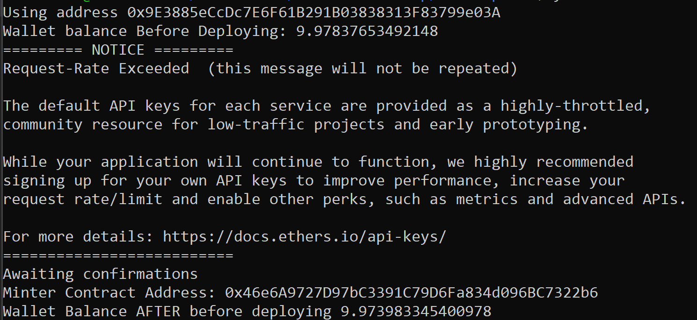
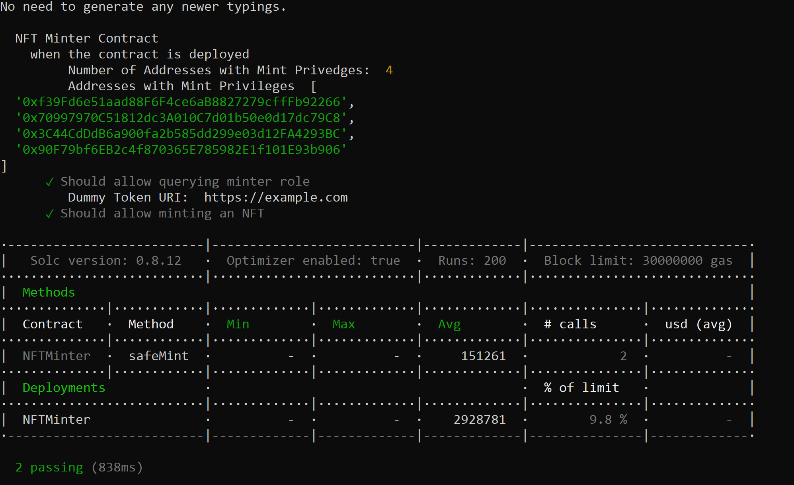

# To Deploy

**NB:** Add `const provider = new ethers.providers.InfuraProvider("ropsten", INFURA_API_KEY)` to deploy script to eliminate the Ropsten rate limiting warning!

See examples from [searching Matheus' class](https://github.com/search?o=asc&q=org%3AEncode-Club-Solidity-Bootcamp-June+Infura&s=indexed&type=Code) repo or from [my teammate](https://github.com/diegoalzate/encode-bootcamp-group-23/blob/02-Homework-Governance/Project/scripts/utils.ts#L23-L31)




# To Build from From Scratch

1. Use your personal `hardhatconfig.ts`

2. Use hardhat 2.9.8 as newer versions break the setup from class.

```
yarn set version berry
yarn add --dev hardhat@2.9.8
yarn add @openzeppelin/contracts
yarn hardhat
yarn hardhat test
```

# To Clone and Install



Use your personal `hardhatconfig.ts`

```
git clone git@github.com:codesport/encode-bootcamp-hw4.git
yarn set version berry
yarn install
```