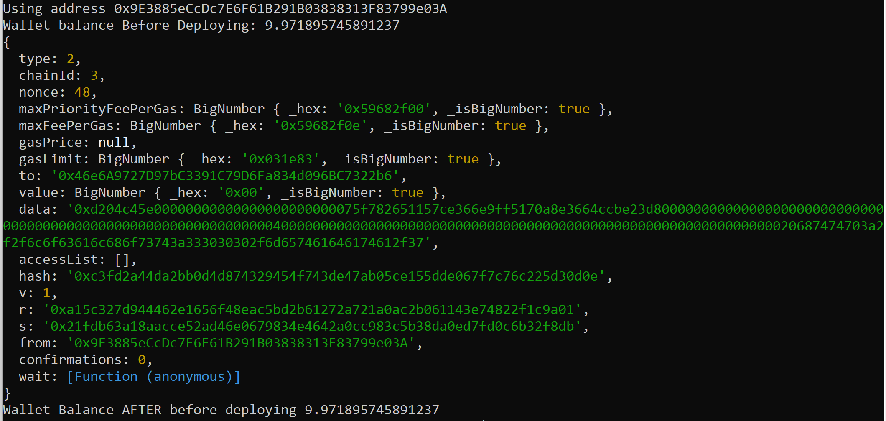

# To Clone and Install

Use your personal `hardhatconfig.ts`

```
git clone git@github.com:codesport/encode-bootcamp-hw4.git
cd encode-bootcamp-hw4
yarn set version berry
yarn install
```

**NB:** `.pnp.cjs` has been added to the commit to work with yarn berry [zero-installs](https://yarnpkg.com/features/pnp#fixing-node_modules). See 4th bullet in link.

## To Deploy

`yarn ts-node scripts/01-deploy-minter.ts`

## Deploy Output


## To Interact

`yarn ts-node scripts/02-interact-nft.ts`

## Partial Interact Output



## To Test

`yarn hardhat test`

### Test Results

Unit test file is in [`test/nft-test.ts`](test/nft-tests.ts)

 


# New Learnings 

1.  Add `const provider = new ethers.providers.InfuraProvider("ropsten", INFURA_API_KEY)` to deploy script to eliminate the Ropsten rate limiting warning!

    * See examples from [searching Matheus' class](https://github.com/search?o=asc&q=org%3AEncode-Club-Solidity-Bootcamp-June+Infura&s=indexed&type=Code) repo or from [my teammate](https://github.com/diegoalzate/encode-bootcamp-group-23/blob/02-Homework-Governance/Project/scripts/utils.ts#L23-L31)

2. Hardhat Runtime Environment Not Set Up in Class Demos. Specifically, `const contract = await hre.ethers.getContractAt("NFTMinter", contractAddress)` doesn't work because `getContractAt()` not available even though `import "@nomiclabs/hardhat-ethers"` has been added to [hardhat.config.ts](https://hardhat.org/hardhat-runner/plugins/nomiclabs-hardhat-ethers#installation) per hardhat documentation

